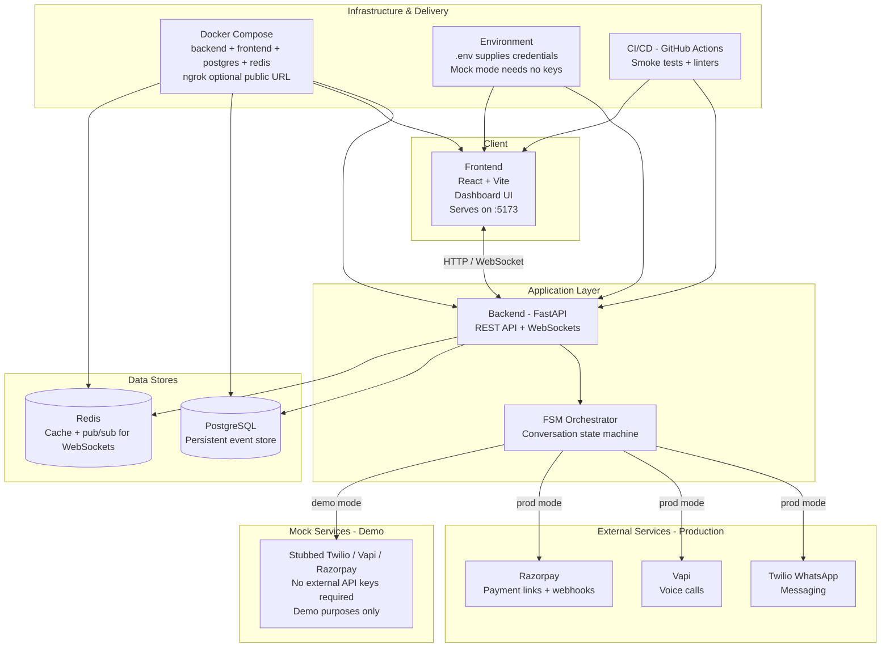

# Recover - Payment Recovery System

## Components

- **Frontend:** React + Vite dashboard for operators.
- **Backend:** FastAPI REST and WebSocket API.
- **FSM Orchestrator:** Controls payment-recovery conversation states and actions.
- **External services:** Twilio WhatsApp, Vapi voice calls, and Razorpay payment links and webhooks.
- **PostgreSQL:** Persists recovery and audit events.
- **Redis:** Stores temporary state and publishes live dashboard updates.
- **Mock services:** Enable end-to-end demonstrations without production credentials.
- **Infrastructure:** Docker Compose runs the application services; environment variables provide configuration; GitHub Actions runs smoke tests and linters.
