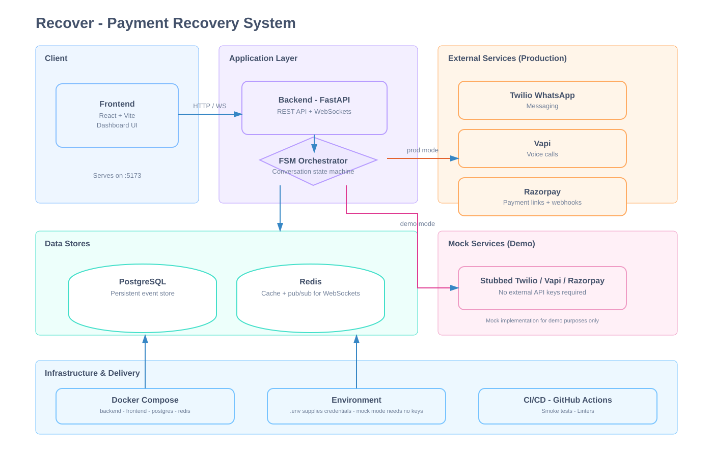

# Recover – AI‑Powered Payment Recovery Engine (Unified Repository)

## Overview

This repository contains the full **Recover** payment‑recovery system split into two logical parts:

| Part | Location | Purpose |
|------|----------|---------|
| **Twilio‑enabled production code** | `C:/Users/ASUS/Downloads/nandika-razorpay/nandika-razorpay` | FastAPI backend, React Vite dashboard, Twilio WhatsApp integration, voice via Vapi. |
| **Mock‑logic demo** | `C:/Users/ASUS/Downloads/nandika-recover-main/nandika-recover-main` | Stand‑alone mock implementation that **simulates** the full flow **without external services**. It is intended **only for demo / testing purposes** and is **not** the permanent production code shown in the video. |

Both folders are intended to be committed together so that a single GitHub repository can be uploaded and cloned elsewhere.

---

## What the project does

1. **Webhook ingestion** – Receives Razorpay `payment.failed` webhooks.
2. **NLU classification** – Uses Groq (or regex fallback) to understand the customer's intent in English, Hindi, or Haryanvi.
3. **Finite‑state machine** – Drives the conversation through deterministic states (`INITIATED → PROMISE_TO_PAY → PAYMENT_RESOLVED`, etc.).
4. **Side‑effects** –
   - Creates a Razorpay payment‑link.
   - Sends a WhatsApp reminder via **Twilio** (production) **or** a mocked message (demo).
   - Optionally places an outbound AI voice call via **Vapi**.
5. **Audit trail** – Persists every event in PostgreSQL, streams updates over a WebSocket, and renders a live dashboard.

> **Note:** The logic in both the production and mock codebases is deliberately written to be **correct and complete**, regardless of whether external services are reachable. The mock version simply stubs out network calls.

---

## Repository layout

```text
.
├─ backend/               # FastAPI backend, FSM, service clients
│   ├─ __init__.py
│   ├─ main.py
│   └─ ... (other modules)
├─ frontend/              # React + Vite dashboard
│   ├─ src/
│   ├─ public/
│   └─ vite.config.ts
├─ docs/                  # Documentation (integration.md, development.md)
├─ infra/                 # Infrastructure scripts (e.g., Terraform, Cloud formation)
├─ docker-compose.yml
├─ Dockerfile
├─ .env.example
├─ .gitignore
├─ ARCHITECTURE.svg
└─ README.md
```

---

## Getting started (production)

1. **Clone the repository** (once it is on GitHub).
2. **Create the environment files**:
   ```bash
   cd nandika-razorpay
   cp .env.example .env
   # edit .env – fill TWILIO_*, GROQ_API_KEY, RAZORPAY_* and any Vapi vars you need
   cd frontend && cp .env.example .env   # add VITE_DEEPGRAM_API_KEY if you use voice
   ```
3. **Start the stack** (Docker Compose will spin up Postgres, Redis and expose the backend on port 8000):
   ```bash
   docker compose up -d
   ```
4. **Run the frontend**:
   ```bash
   cd frontend
   npm install
   npm run dev   # Vite dev server proxies /api → http://127.0.0.1:8000
   ```
5. **Expose the backend for Twilio / Vapi** – e.g. with ngrok:
   ```bash
   ngrok http 8000
   # set PUBLIC_BASE_URL in .env to the https URL ngrok gives you
   ```
6. Open the dashboard at `http://localhost:15173` and verify the **preflight** endpoint (`GET /config/preflight`).

---

## Getting started (mock version)

The mock folder provides a completely self‑contained environment that does **not** require real Twilio, Vapi, or Razorpay credentials. It is **only** for demonstration, testing and CI purposes.

```bash
cd nandika-recover-main
# No .env is needed – mock mode is the default
docker compose up -d   # starts the same services but the backend uses stubbed clients
cd frontend
npm install
npm run dev
```

You can now exercise the full UI flow; all external calls are simulated and recorded in the local PostgreSQL database.

---

## Documentation

- **`docs/integration.md`** – detailed steps for configuring Twilio Sandbox, Vapi keys, Razorpay webhooks, and ngrok.
- **`docs/development.md`** – how to run unit tests, linting, and contribute.
- **`backend/README.md`** – architecture of the FastAPI service, FSM, and client abstractions.
- **`frontend/README.md`** – UI component guide, WebSocket handling, and state‑mapping.

All docs are kept in the `docs/` directory and referenced from this top‑level README.

---

## Contributing

1. Fork the repo on GitHub.
2. Create a feature branch.
3. Ensure the code passes the smoke test:
   ```bash
   python scripts/smoke_test.py   # from the root of each sub‑project
   ```
4. Open a pull request – CI will run the same tests against both the production and mock folders.

---

## License

Apache 2.0 – see `LICENSE` at the repository root.

## Architecture Diagram



---

---

*This README was generated to give a clear, single source of truth for the combined repository, making it ready for upload to GitHub.*
